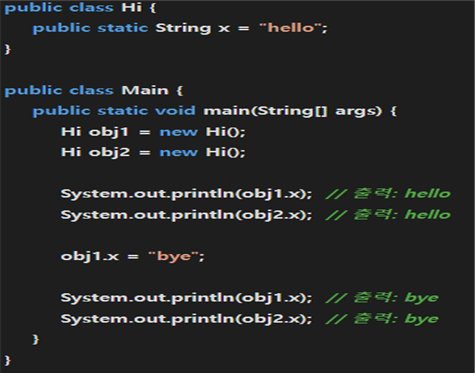
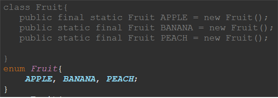
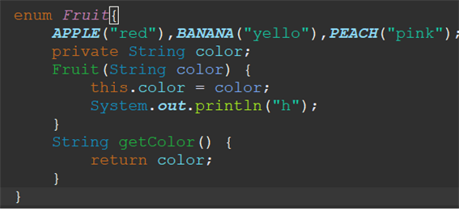

## COW SPRING 2기 PRE-ONBOARDING 학습 과제

### 자바의 필수 개념들을 차근차근 살펴보자.

* 자바의 primitive Type과 Reference Type은 어떤 차이가 있나요?   
 primitive type이란 원시적인 형태로  정수(int), 실수(float), 문자(char), 논리(boolean) 등이 존재한다. 기본적으로 프로그램이 돌아가기 위한 최소한의 준비물이라고 생각한다. 그리고 Reference Type 변수란 객체 참조 변수 라고도 불리는 데, "참조란 특정한 곳에서 찾는다." 라는 뜻을 가졌다. 
   
   
   
    자바는 메모리를 효율적으로 관리하기 위해서 JVM이라는 가상 머신을 사용한다. ( JVM이 하드웨어인 메모리를 직접 관리하는 것이 아닌 운영체제(OS)와 상호작용하면서 자바 프로그램의 실행에 필요한 메모리를 요청하고 할당받는 것이다.) 
    
    
    자바의 메모리는 크게 힙과 스택이 두가지 영역으로 나뉘어진다.( static이라는 추가적인 영역이 존재한다.) 힙은 생성된 객체들을 저장하고 스택은 primitive type의 지역변수와 생성된 객체를 참조할 수 있는 변수(Reference type의 변수)를 저장한다. 즉 클래스를 이용하여 객체를 만들 때 그것을 사용하기 위해 이름을 선언하고 객체와 이름을 바인딩하는 데, 그때 실제로 바인딩 되는 것은 객체 그 자체가 아닌 객체가 할당되어 있는 메모리 주소와 바인딩 되는 것이다. 그 바인딩 된 이름은 스택에 저장되고 실제 객체는 힙에 저장된 것이다. 이렇게 실제 값이 아니라 메모리 주소값을 갖고 있는 변수들을 Reference Type이라고 한다. 
    

    primitive type과 reference type의 차이는 저장되는 위치가 다르고 또 primitive 타입에는 null값을 할당할 수 없고 referencee 타입에는 null값을 할당할 수 있다. 추가로 제네릭 타입에서 사용 가능 여부의 차이도 존재 하는 데  제네릭 타입이란 다양한 타입의 객체를 다룰 수 있도록 일반화된 타입을 나타내는 기능이다. 제네릭타입을 사용하면 클래스나, 메소드를 정의할 때 실제 사용될 타입을 지정하지 않아도 된다. 즉 String, Integer 변수 중 어떤 거를 쓸건지 미리 정하지 않고 <T> 이것으로 대신 받아서 String이면 String으로 되고 Integer면 Integer로 사용할 수 있게 하는 기능이다. 하지만 이 때 주의해야하는 건 primitive타입은 안되고 참조변수만이 가능하다.

* 자바의 접근 제어자에 대해 설명해주세요.   
접근 제어자란 클래스, 변수, 메서드 등의 멤버에 대한 접근 권한을 지정하는 명령어이다.자바에는 접근 제어자가 총 public, private, protected, default로 4가지가 있다. 여기서 말하는 접근이란 직접적인 호출 및 수정을 얘기한다. 
  + public : 가장 넓은 범위의 접근 제어자로써, 해당 맴버는 어떤 클래스에서든지 직접적으로 접근 할 수 있다.
 
  + private : 가장 제한적인 범위로, 해당 멤버는 선언된 클래스 내부에서만 직접적으로 접근 할 수 있다. 외부, 하위 클래스에서도 직접적인 접근이 불가능하다. Hello라는 클래스에 hello()라는 메서드가 존재한다고 가정하고 다른 클래스에서 Hello 객체를 만들어도 그 클래스에선 hello()라는 메서드 호출이 불가능하고, private한 클래스라면 객체로 만드는 것도 불가능하다. 이것이 접근 불가능의 의미이다.

  + protected: public과 default 접근 제한의 중간쯤으로 같은 패키지에는 접근 제한이 없지만 다른 패키지일 경우에는 자식 클래스만 접근을 허용한다. 여기서 말하는 자식 클래스란 protected의 클래스를 상속받은 클래스를 의미힌다.

  + default : 별도의 접근 제어자가 지정되지 않았을 때 적용되는 접근 제어자로써 동일한 패키지 내에서만 해당 멤버에 접근할 수 있으며, 다른 패키지에 속한 클래스에서는 직접적인 접근이 불가능이다.

     -자바에선 클래스들을 패키지로 그룹화해서 관리하고 패키지를 통해 이름 충돌을 방지하고 코드 구조를 조직화 하기 때문에 패키지가 접근 제어자를 기준으로 된 것이다.

* static 키워드에 대해 설명해주세요.   
 자바에서 특정 멤버(메서드, 변수, 블록)을 클래스 수준의 멤버로 사용하기 위한 명령어이다. static 멤버는 클래스에 속하며 객체의 생성과는 독립적으로 사용된다.    
 클래스 수준의 멤버라는 것은 객체의 생성과는 독립적으로 존재할 수 있고 클래스 내부에 사용하는 메서드나 변수가 static 멤버라면 같은 클래스로 만들어진 객체는 그것을 공유된다는 것을 의미한다. 일반적으로 클래스 내부에서 그냥 선언된 변수와 메서드는 해당 클래스의 객체에 속하게 돼서 특정 객체를 생성해야만 접근이 가능하고 각각의 객체마다 독립적인 값을 가진다. 이렇게 static으로 선언이 되면 클래스 로딩 시점에 정적 영역에 생성이 된다. 위에서 힙과 스택이 나왔 었 는데, 추가적인 영역으로 모든 클래스, static 멤버들이 여기에 할당된다. static 영역은 JVM의 메모리 공간 중의 하나로서, 프로그램이 실행되는 동안 쭉 유지되는 데이터와 코드를 저장하는 공간이다. 그렇기에 static이면 객체로 생성하지 않아도 이미 static 영역에 할당이 되어있고 그로 인해 객체로 생성을 하지 안하고 바로 호출을 할 수 있는 것이다.추가적인 코드로 예시를 들면, Hi 클래스 안에 static String x = “hello“ 가 있을 때 그 클래스 객체를 2개 만들고 하나의 객체에서 x를 “bye“로 바꾸면 다른 객체의 x도 bye로 바뀐다.
 

* final 키워드에 대해 설명해주세요.
  * ++ 상속 관련된 내용도 포함할 것!   
  final의 키워드는 필드(변수), 메서드, 클래스에 사용되는 키워드이다. 고정시킨다는 의미를 가진다고 생각하면 좋다.
      + Final 변수: final로 선언된 변수는 상수로 취급되며, 한번 초기화되면 그 값을 변경할 수 없다. 그 값이 고정된다.
      + Final 메서드: final로 선언된 메서드는 overriding이 불가능하다. 여기서 잠깐 말하면 부모 클래스의 메서드를 재정의한다는 것이 overriding으로 메서드에 앞에 Final이 있으면 재정의를 하지 못한다는 의미이다.
      + Final 클래스: final로 선언된 클래스는 상속이 불가능하다. 즉 다른 클래스에서 이 클래스를 상속 받을 수 없다. 상속받을 수 있는 마지막 단계라고 생각하면 좋다.

* 오버로딩(Overloading)과 오버라이딩(Overriding)에 대해 설명해주세요.   
 두 개념이 이름이 비슷한 이유는 비슷하게 생겼고 덧붙이는 개념이여서 그런 것 같다. 두 개념 다 객체지향 프로그래밍에서 다형성을 구현하기 위해 사용되는 개념이다. 
 + Overloading:같은 이름의 메서드를 여러 개 정의하는 것을 의미한다. 이름만 같지 매개변수의 타입, 개수, 순서가 서로 다른 경우로 여러개로 만들어서 사용될 수 있다. 이름이 같은 메서드이지만 매개 변수 타입이 int나 string이나 null인 경우에 각각에 맞게 메서드를 구현 하고 싶을 때 사용된다.    
 ```int add(int a, int b){ return a+b; }```   
  ```double add (double a, double b){ return a+b;}```  
 이렇게 직접만든 메서드 뿐 아니라 생성자도 오버로딩이 가능하다! 기본적인 생성자는 아무런 매개변수가 없지만, 매개 변수가 있는 것과 없는 것 둘 다 만들면 받아오는 인자에 따라서 다르게 생성자가 선택된다.   

 + Overriding:Overriding은 상속과 다형성 개념과 밀접하게 연관되어 있다. 상위 클래스 { => 상속이란 클래스 간의 관계를 맺어주는 개념으로 상위 클래스(부모클래스)의 필드와 메서드들을 하위 클래스에서 구현하지 안하고도 사용 할 수 있게 해주는 것} 에 이미 정의된 메서드와 동일한 시그니처( 메소드 이름, 반환타입, 매개변수 타입 및 순서 )를 가진 하위 클래스에서 해당 매서드를 재정의하는 것을 의미한다. 부모 클래스에 있는 메서드와 완전 똑같이 생긴 메서드가 하위 클래스에서 다시 정의되는 것을 의미한다. 이것을 통해 부모 클래스의 동작을 따라하면서도 추가로 자식 클래스만의 특화된 동작을 할 수 있게 해준다.

* 추상 클래스와 인터페이스는 각각 무엇이고, 어떤 차이를 가지는지 설명해주세요
  * 반드시 추상 클래스와 인터페이스의 사용 목적을 명시해주세요.   
  추상 클래스와 인터페이스가 가지는 가장 큰 특징은 추상 메서드가 존재한다는 것이다. 추상 메서드는 접근제어가, 리턴타입, 이름, 매개변수만이 정의되고 본체는 정의되지 않은 메서드를 의미한다.   
   추상 클래스는 이러한 추상 메서드가 하나 이상 존재하는 클래스를 의미하고 인터페이스는 가진 모든 메서드가 추상 메서드인 클래스를 의미한다. 추상 클래스가 가진 추상 메서드에는 abstract라는 키워드가 붙고 이러한 추상 메서드가 존재할 경우 class를 선언할 때도 abstract 키워드가 붙어야 한다. 추상 클래스는 상속을 강요한다. 추상 클래스는 상속을 강요하는 것이다. 이것을 사용하는 이유는 여러 클래스들이 동일한 필드와 메서드를 가지고 있지만 몇 개의 메서드는 큰 구조는 똑같지만 세부 내용은 각자 다르게 정의할 수 있다. 이 추상 클래스를 상속받은 하위클래스는 기능은 확장되고 추상메서드를 구체화하여 사용하게 된다.    
   인터페이스는 class로 정의되지 않고 interface로 정의가 되며 모든 멤버 메서드는 추상 메서드로 선언이 된다. 이 인터페이스 또한 상속을 강요한다. 이것을 사용하는 이유는 큰 틀을 제공하기 위함이다. 즉 설계도라고 보며 된다. 인터페이스에 있는 추상 메서드들이 무조건 상속받은 클래스에서 메서드들이 재정의되게 할 수 있다. 추상클래스는 상속받은 하위클래스에게 이것을 베이스로 추가적인 기능에다가 자신만의 구체적인 기능을 제공하고 인터페이스는 상속받은 하위클래스에게 어떤 것들이 포함되어야하는 지 강제로 다 구현하도록 하는 것이다. 차이점으로는 추상 클래스에서는 일반적인 필드와 메서드들이 포함 될 수 있다. 하지만 인터페이스는 모든 메서드들이 추상 클래스이다. 그리고 추상 클래스는 1개만 상속 될 수 있지만 인터페이스는 여러개를 상속받을 수 있다. 또 인터페이스에서 필드를 정의하면 그 필드는 public final static이 암시적으로 적용된다. 추가로 인터페이스 끼리 extends가 된다.

* Java Enum에 대해 설명해주세요.
 자바에는 상수라는 개념이 존재한다. 상수는 변하지 않는 값으로 정의된다. 1은 1로 무조건 고정인 것처럼 final이라는 키워드를 사용하면 변수들도 상수처럼 사용할 수 있다. 그럴 때 문제가 생기는 것이 변수를 상수 취급을 하는 데 같은 상수 값을 가진 변수라면 다른 변수임에도 불구하고 같은 값으로 인식이 된다. 그것을 해결할 수 있는 방법으로는 연관된 상수들을 모아 클래스로 만들고 각각의 객체를 만드는 것이다. 그러면 그것들은 각자 다른 객체가 되어 상수로 취급되면서 고유한 값을 가질 수 있게 된다. 하지만 이럴 경우에 매번 그렇게 만들기도 그렇고 case문을 사용할 때 조건에 들어 갈 수 없다는 문제가 있다. 그래서 나온 것이 Enum이다. Enum은 연관된 상수들의 집합을 쉽게 만들기 위한 문법인 것이다.   

        

  이 두 코드는 동일하다. 여기서 끝이 아니라 생성자,메서드 또한 구현이 가능하다.
      

  이것을 통해 상수로 취급하고 싶은 변수들을 독립적이고 집합적으로 만들 수 있다.

* 객체지향이란 무엇일까요? 객체지향을 지키면 어떤 이점을 얻을 수 있나요?   

  객체지향이란 컴퓨터 프로그래밍의 패러다임(관점) 중 하나이다. 이것과 크게 비교되는 것은 절차지향으로써 프로그램을 절차(순서)에 따라서 전체가 잘 흘러가게 만드는 것을 초점을 두는 것이다. 그렇기 때문에 데이터와 데이터를 조작하는 절차들로 이루어진 프로그램을 작성한다. 데이터의 흐름이 전체의 흐름과 다름 없기 때문이다. 하지만 객체 지향은 함수 중심이라고 볼 수 있다. 그 함수는 객체의 동사적 행위를 갖는 다. 그래서 객체들의 상호작용으로 프로그램이 흘러간다. 객체, object 라는 단위로 프로그램을 쪼갠다. 객체는 필드, 메서드를 가지고 있다. 필드란 자신이 받을 수 있는 변수로 속성을 나타낼 수 있다. 메서드는 동사적 행위로 속성을 바꾸거나 상태를 변화시키는 행위를 말한 다. 이러한 것들을 가진 객체를 특정 업무를 맡은 담당자라고 볼 수 있다. 이렇게 업무자로 나누면 좋은 점이 코드의 재사용이 가능하다는 것이다. 절차 지향 프로그램에서도 다른 클래스에 있는 함수를 사용할 수 있지만 해당 클래스가 제공하는 헤더 파일을 포함시켜야 하고 객체 인스턴스와 메서드 호출 형태로 직접적으로 접근하지 않고 외부에서 필요한 기능들을 참조해서 사용하는 것 뿐이다. 하지만 객체지향인 경우 인스턴스로 만들어서 직접적으로 접근할 수 있고, 상속을 통해 코드를 구현하지 않고도 특정 메서드를 사용할 수 있고 그뿐이 아니라 Overloading과 Overriding 덕분에 상황에 따라 다르게 사용할 수도 있다. 또 코드가 가독성이 좋고 직관적이다. 실제로 업무를 담당하는 객체들을 구현하고 그것들의 상호작용을 나타난 것이기 때문에 코드만 봐도 어떤 업무를 하고 어떻게 상호작용하는 지 알 수가 있다.

* 자바 객체지향의 4대 특성에 대해 각각 설명해주세요.
  + 추상화 : 추상이란 사물이나 형상에 공통되는 규칙을 뽑는 것을 말한다. 본질적이고 공통되는 부분을 추출하여 그것을 상위 클래스로 만든다. 그렇게 한다면 그것들의 하위 개념들을 만들 때 정말 편리해질 것이다. 이것이 자바에선 인터페이스, 추상클래스로 가능해진다. 어떤 객체가 수행해야하는 핵심적인 역할만을 규정해두고 실제적인 구현은 인터페이스를 구현하는 각각의 객체에서 하도록 프로그램을 설계할 수 있다. 


   + 캡슐화: “캡슐화는 데이터와 해당 데이터를 처리하는 메서드(함수)를 하나로 묶어 내부 구현 세부사항을 외부로부터 감추는 것을 의미”한다. 위에서 객체는 필드와 메서드를 가지고 있다고 했다. 그리고 접근 제어자 얘기도 했었다. 객체를 만드는 것은 클래스이다. 객체가 가진 필드와 메서드에 접근을 못하게 하고 싶으면 접근 제어자로 접근을 할 수 없게 만들 수 있다. 이렇게 하면 얻을 수 있는 장점은 외부로부터 숨길 수가 있다라는 점이다. 사용자가 이것이 어떻게 구현되는 지 알 필요 없이 허락된 것들로만 쉽게 사용할 수 있게 만들 수 있다. 컴퓨터를 보면 사용자 입장에선 컴퓨터 전원만 키면 컴퓨터가 돌아가지만 실제 컴퓨터 내부에선 전원장치에 전원이 공급이 되고 여러 회로를 통해 켜지는 걸 알 필요 없는 것처럼 숨길 수가 있다. 거기다가 외부로부터 보호할 수 있다. 꼭 지켜야하는 필드에 접근을 막아 외부의 영향에 상관없이 유지할 수 있다.


   + 상속 : 상속이란 “기존 클래스(부모 클래스가 된다.)를 확장하여 새로운 클래스(자식 클래스)를 생성한다”라는 개념이다. 여러 클래스들 중에서 동일한 구조와 필드를 가지고 동사적 행위를 가지고 있을 때 그것을 일반화하여 상위 클래스로 만드는 추상과정을 거칠 수 있다. 하위 클래스들은 상위 클래스들을 상속을 받으면 부모 클래스의 필드와 메서드를 사용할 수 있고 거기다가 자신만의 고유한 필드나 메서드를 추가할 수 있다. 거기다가 Overriding이라는 개념으로 상위 함수가 가진 메서드와 시그니처가 같다면 그것을 재 정의할 수 있다. 이것을 통해 코드 재사용성이 증가하고 프로그램 설계가 더 쉬워진다.
   + 다형성: 상속, 인터페이스 개념에 기반했을 때 구현된다. 자바는 Strongly Type언어로써 변수 이름을 만들 때 이름에 어떤 타입이 올지 정의가 되어야 한다. ex) String a = “hi“. 하지만 상위 클래스의 타입으로 정의된 이름에는 하위 클래스의 타입의 객체와 바인딩이 될 수 있다. 여기서 중요한 건 상위 클래스에 존재하는 메서드와 하위 클래스에 존재하는 메서드가 서로 시그니처가 동일하다면 저렇게 바인딩 된 이름으로 그 메서드를 호출한다면 하위 클래스에 존재하는 메서드가 호출된다는 것이다. 이것은 여러개의 하위 클래스들이 하나의 상위 클래스 타입에 바인딩되면 각각의 객체에 맞게 적절한 동작이 실행된다는 것을 의미한다.   